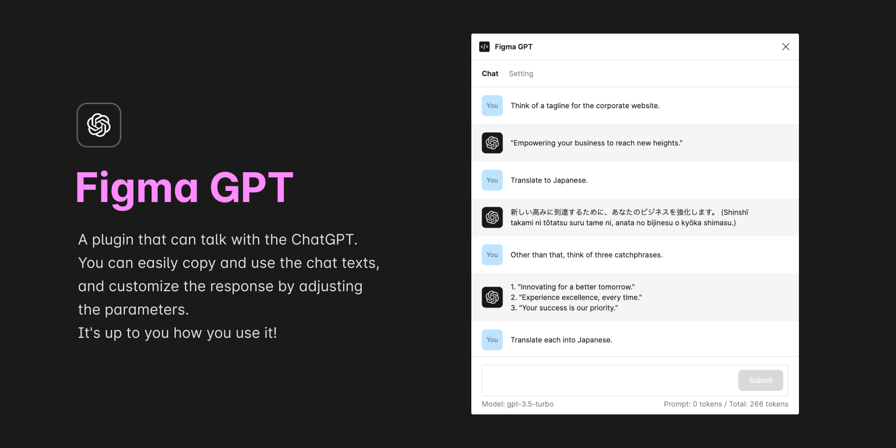

# Figma GPT Plugin

A plugin that can talk with the ChatGPT (**It has the same performance as [ChatGPT website](https://chat.openai.com/chat)**).  
You can easily copy and use the chat texts, and customize the response by adjusting the parameters.  
You can also have AI code generation and code completion. The code can be easily copied and executed as code for Figma plugins.  
It's up to you how you use it!

## 🔥 How to use

1. Get an OpenAI API Key from the [OpenAI website](https://platform.openai.com/account/api-keys).
2. Run this plugin.
3. Open the "Settings" tab and input the API Key you got in the "OpenAI API Key" field.
4. Open the "Chat" or "Code" tab and have fun 🤟

## 📮 Support

If you have any problem or feedback, please use the [GitHub Issues](https://github.com/ryonakae/figma-plugin-figma-gpt/issues).

---

This plugin is made by Ryo Nakae 🙎‍♂️.

- https://brdr.jp
- https://twitter.com/ryo_dg
- https://github.com/ryonakae
